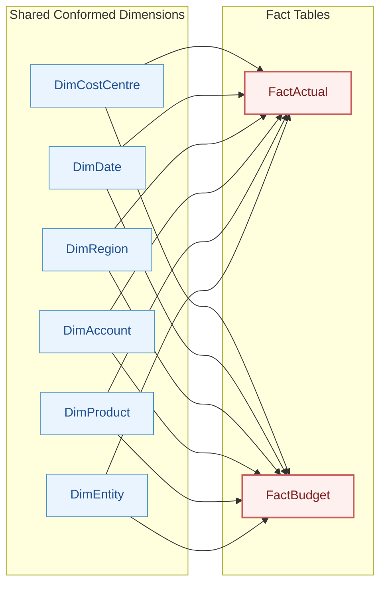

# Finance Data Model Design

## 1. Management P&L Structure

The Financial Performance & MI Reporting Solution uses the following management P&L structure:

Revenue
- Subscription Revenue
- Usage Revenue
- Professional Services Revenue
- Other Revenue

Cost of Revenue
- Hosting & Infrastructure
- Customer Support
- Payment Processing
- Implementation Costs

Gross Profit

Operating Expenses
- Sales & Marketing
- Technology & R&D
- General & Administrative
- People & HR

EBITDA

## 2. Chart of Account Design

The Chart of Accounts acts as controlled master data between source-system transactions and management reporting.

Each GL account is mapped to:

- Account name
- Account Type
- P&L category
- P&L subcategory
- Reporting order
- Normal accounting balance
- Variance treatment

Reporting classifications are maintained in master data rather than embedded directly in transactional records. This allows reporting structures to be changed without modifying historical transactions.

## 3. Fact Tables

### FactActual

**Grain:** One row per general-ledger transaction line.

The table will contain actual financial transactions extracted from the simulated ERP system.

Key dimensions will include:

- Posting Date
- GL Account
- Cost Centre
- Product
- Legal Entity
- Region

### FactBudget

**Grain:** One row per month, account, cost centre, product, entity, region and budget version combination.

The table will contain financial planning data extracted from the simulated planning system.

FactActual and FactBudget will share conformed dimensions to allow consistent Actual vs Budget reporting.

## 4. Master Data Dimensions

### DimAccount

Provides the financial reporting hierarchy used to translate general-ledger accounts into management P&L reporting lines.

Key attributes include:

- Account Code
- Account Name
- Account Type
- P&L Category
- P&L Subcategory
- Reporting Order
- Normal Balance
- Variance Logic

### DimCostCentre

Represents the organisational ownership of financial activity.

Key attributes include:

- Cost Centre Code
- Cost Centre Name
- Department
- Business Function
- P&L Reporting Group
- Manager Role

Account classification and cost centre classification serve different purposes. Accounts describe the nature of financial activity, while cost centres identify organisational responsibility.

### DimProduct

Provides the product hierarchy used for revenue and cost analysis.

Key attributes include:

- Product Code
- Product Name
- Product Category
- Revenue Model
- Strategic Segment

### DimEntity

Represents the legal entities within the Aurelia Technologies group.

Key attributes include:

- Entity Code
- Entity Name
- Country
- Functional Currency
- Entity Type

### DimRegion

Provides the management geography used for regional performance reporting.

Key attributes include:

- Region Code
- Region Name
- Region Group

## 5. Logical Data Model

The reporting solution uses a dimensional modelling approach with two fact tables:

- `FactActual` — transaction-level general ledger actuals
- `FactBudget` — monthly budget data

Both fact tables share the same conformed dimensions:

- `DimDate`
- `DimAccount`
- `DimCostCentre`
- `DimProduct`
- `DimEntity`
- `DimRegion`

Each dimension connects directly to the fact tables. Dimension hierarchies are stored as attributes within the dimension tables rather than being normalised into additional tables.

Each fact table therefore forms a star schema, while the overall reporting model is a **fact constellation (galaxy schema)**.

`DimEntity` represents the legal entity in which financial activity is booked, while `DimRegion` represents the commercial management-reporting geography. These dimensions are intentionally maintained separately because legal-entity structure and commercial reporting structure are not necessarily one-to-one.

## 6. Table Grain

| Table | Grain |
|---|---|
| FactActual | One row per general-ledger transaction line |
| FactBudget | One row per month, account, cost centre, product, entity, region and budget version |
| DimAccount | One row per GL account |
| DimCostCentre | One row per cost centre |
| DimProduct | One row per product |
| DimEntity | One row per legal entity |
| DimRegion | One row per management reporting region |
| DimDate | One row per calendar date |

## 7. Source Data Schemas

### 7.1 ERP Actual Transactions

**Source:** Simulated ERP General Ledger

**Grain:** One row per general-ledger transaction line.

| Field | Description |
|---|---|
| transaction_id | Unique identifier for the GL transaction line |
| document_id | Identifier for the originating accounting document |
| posting_date | Date on which the transaction is posted to the general ledger |
| account_code | GL account code |
| cost_centre_code | Organisational cost centre responsible for the transaction |
| product_code | Product associated with the financial activity |
| entity_code | Legal entity in which the transaction is booked |
| region_code | Commercial management-reporting region |
| transaction_currency | Currency of the original transaction |
| transaction_amount | Amount in the original transaction currency |
| local_currency | Functional currency of the legal entity |
| local_amount | Amount translated into the legal entity's functional currency |
| source_system | Originating source system |
| journal_type | Classification of the journal entry |
| description | Short transaction description |
| load_date | Date on which the record was loaded into the reporting process |

### 7.2 Budget Data

**Source:** Simulated Financial Planning System

**Grain:** One row per month, account, cost centre, product, entity, region and budget version.

| Field | Description |
|---|---|
| budget_id | Unique identifier for the budget record |
| budget_month | Month to which the budget relates |
| account_code | GL account used for financial planning |
| cost_centre_code | Cost centre responsible for the budget |
| product_code | Product associated with the budget |
| entity_code | Legal entity |
| region_code | Commercial management-reporting region |
| budget_version | Planning version |
| budget_currency | Currency in which the budget is maintained |
| budget_amount | Budget amount |
| source_system | Originating planning system |
| load_date | Date on which the record was loaded into the reporting process |

Budget records will use the first calendar day of each month as the date key, allowing monthly budget data to share the same Date dimension as transaction-level Actual data.

## 8. Source Data Business Rules

The synthetic source data will follow defined business rules to ensure that generated transactions reflect realistic financial relationships rather than purely random combinations.

### Actual Data Rules

- Revenue accounts should normally contain positive economic revenue values.
- Expense accounts should normally contain positive economic cost values.
- Corporate overhead accounts will normally use the Corporate / Non-Product product code.
- Product-related revenue accounts should map to logically relevant products.
- Payment-related revenue and processing-fee accounts should primarily relate to the Payments product.
- Engineering-related expenditure should primarily be associated with Engineering or Technology cost centres.
- Customer-support and implementation costs should primarily be associated with Customer Operations cost centres.
- Legal entity functional currency must agree with the entity master.
- Commercial region is independent of legal entity and may differ from the entity's country.
- Each transaction_id must be unique.

### Budget Data Rules

- Budget data will be generated at monthly grain.
- Budget accounts and organisational dimensions must use valid master-data values.
- Budget currency should normally agree with the entity functional currency.
- Management reporting will use the approved annual budget version.
- Budget values will broadly reflect expected Actual activity but will include realistic favourable and unfavourable variance patterns.

## 9. Planned Data Quality Test Cases

The synthetic dataset will intentionally include a small number of controlled data-quality exceptions so that the reporting solution can demonstrate validation and reconciliation processes.

Planned exceptions include:

- Duplicate GL transaction IDs
- Invalid account codes
- Invalid cost centre codes
- Missing region mappings
- Entity and functional-currency mismatches
- Unexpected budget versions
- Duplicate budget intersections

These exceptions will be identified through SQL-based data-quality controls before records are promoted into the reporting layer.